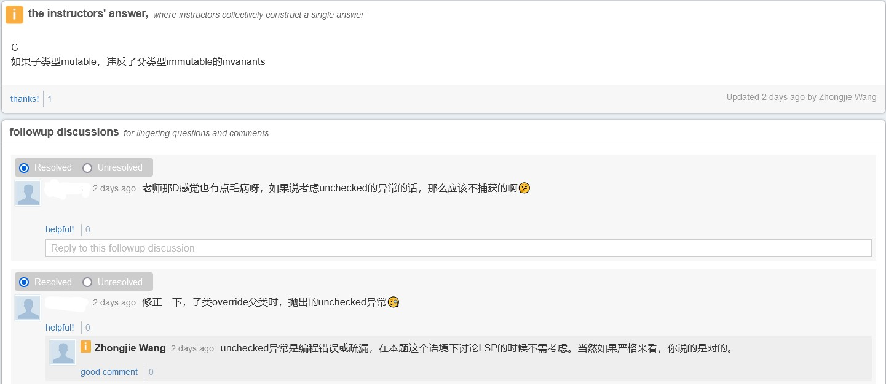

# 选择题部分答案

## 说明

- 此答案为个人整理，并非课程组老师发布（部分题目在答疑时问过老师）
- 仅包含2021年课程考试范围内题目，不保证正确性，仅供参考
- 大题部分可参考习题课和课件示例，内容较多，此处略

## 2018

1. 【C】见Chapter 1课件第12页。
2. 【D】Git仓库记录变化的文件，见 Chapter 3课件第50页。
3. 【B】
4. 【D】spec1强于spec2（后置条件相同，前置条件spec1更弱），但spec3与其余两个无法比较（前置条件最弱，后置条件因抛出异常也比其余两个弱）。
5. 【A】
6. 【C】ADT可能存在表示泄露，内部属性被修改但未使用mutator方法，可能导致RI被违反。
7. 【C】`this.name`未进行`toLowerCase()`转换。
8. 【存疑】附图：  

9. 【B】Java的重写要求：参数列表（类型+个数）必须相同，访问修饰符不能增强限制，可以消除或减少异常，返回值类型可以相同或为父类返回值的子类型。
10. 超纲。
11. 超纲。
12. 【B】
13. 超纲。
14. 超纲。
15. 超纲。
16. 【C】

## 2019

1. 【C】
2. 【B】
3. 【C】
4. 【D】
5. 【C】
6. 【D】
7. 【D】
8. 【C】
9. 【B】顺序从下到上为栈底到栈顶，A选项完全相反；B选项自定义异常可以为checked类型，也可实现为unchecked类型，主要取决于方法是否声明`throws`；C选项因无法确定异常是否为checked，不一定有`throws`；D选项异常可能被捕获后又抛出(re-throw)。
10. 【B】
11. 超纲。
12. 超纲。
13. 超纲。
14. 超纲。
15. 【B】

## 2020A

1. 【B】外部质量属性包括正确性、健壮性、可扩展性、可复用性……
2. 【AC】一个Git本地仓库可以关联多个远程仓库，合并分支可以对两个及两个以上进行。
3. 【B】
4. 【A】D输出结果确为地址（此题了解一下得了）。
5. 【C】String是immutable的，可以画个Snapshot Diagram理解一下。
6. 超纲。
7. 【C】可以在定义时赋值。
8. 【C】例：接口中的静态工厂方法。
9. 【C】两者之间无父子关系。
10. 【C】`hashCode()`保证相等对象值相等即可，全都是同一值不影响功能实现，就是性能会变差。A其实也说得过去。
11. 【A】
12. 超纲。
13. 【A】
14. 【C】
15. 【B】
16. 超纲。
